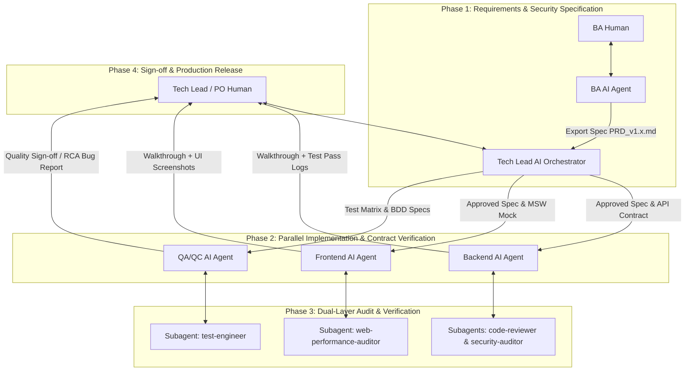

# SDLC With AI Workflow

Tập hợp bộ Quy trình Vận hành Chuẩn (SOP - Standard Operating Procedures) quy định mô hình phát triển phần mềm **Spec-Driven & Test-Driven SDLC** phối hợp giữa **Con người (Engineering Team)** và **AI Agents / Subagents**.

> [!NOTE]
> **TÍNH ĐỘC LẬP VỚI NỀN TẢNG (AGENT-AGNOSTIC PRINCIPLE)**
> Bộ quy trình này được thiết kế hoàn toàn độc lập và không phụ thuộc vào bất kỳ công cụ AI Agent cụ thể nào. Quy trình áp dụng đồng nhất cho **Google Antigravity, Claude Code, Cursor, Windsurf, GitHub Copilot Workspace** hoặc bất kỳ hệ thống AI Agent hỗ trợ gọi Tool / MCP nào.

---

## 1. Danh Mục Tài Liệu SOP

| Tài liệu SOP | Vai trò | Trách nhiệm chính |
| :--- | :--- | :--- |
| 👑 [sop_tech_lead_orchestrator.md](file:///d:/Projects/Personal/AI/_pet/SdlcWithAIWorkFlow/sop_tech_lead_orchestrator.md) | **Tech Lead / System Architect** | Điều phối liên vai trò (Cross-role Orchestration), duyệt API Contract, quản lý Spec Drift & Deprecation Policy |
| 📄 [sop_ba_ai_workflow.md](file:///d:/Projects/Personal/AI/_pet/SdlcWithAIWorkFlow/sop_ba_ai_workflow.md) | **Business Analyst (BA)** | Chuyển đổi Yêu cầu thành BDD Given-When-Then, Mermaid Diagrams, Security Matrix & Versioning |
| ⚙️ [sop_backend_ai_workflow.md](file:///d:/Projects/Personal/AI/_pet/SdlcWithAIWorkFlow/sop_backend_ai_workflow.md) | **Backend Engineer** | Lập Plan API/DB, TDD Red-Green-Refactor, phòng chống N+1 query, Rollback Plan & Subagent Audit |
| 🎨 [sop_frontend_ai_workflow.md](file:///d:/Projects/Personal/AI/_pet/SdlcWithAIWorkFlow/sop_frontend_ai_workflow.md) | **Frontend Engineer** | Phủ 5 UI States, MSW API Mocking, Type-safe Component Scaffolding, Visual Check & Core Web Vitals |
| 🧪 [sop_qa_qc_ai_workflow.md](file:///d:/Projects/Personal/AI/_pet/SdlcWithAIWorkFlow/sop_qa_qc_ai_workflow.md) | **QA / QC Engineer** | Test Matrix, Automation Playwright/API/Security Scripts, Visual Regression & Cross-role RCA Bug Escalation |

---

## 2. Bảng Tổng Hợp Shared Skills & MCP Servers Trong SDLC

Để chuẩn hóa khả năng của AI Agent qua các vai trò, dự án khuyến nghị kết nối các **MCP (Model Context Protocol) Servers** và tích hợp các **Skills** chuẩn sau:

### 2.1 Danh Mục MCP Servers Dùng Chung (Shared MCP Servers)

| MCP Server | Mục đích sử dụng trong SDLC | Vai trò áp dụng chính |
| :--- | :--- | :--- |
| **`jira` / `confluence`** | Truy vấn/Tạo User Stories, Sprint Backlog, PRDs, Meeting Notes | BA, Tech Lead, QA |
| **`github` / `gitlab`** | Quản lý Repo, tạo Branch, Pull/Merge Request, CI Lint, Commit Status | BE, FE, QA, Tech Lead |
| **`playwright`** | Tự động hóa trình duyệt, Visual Regression, DOM Snapshots, Screenshot Verification | FE, QA |
| **`mysql` / `postgresql`** | Kiểm tra Schema DB, xác minh dữ liệu migration & truy vấn trực tiếp | BE, QA, Tech Lead |
| **`context7`** | Tra cứu tài liệu kỹ thuật chính thức của thư viện/framework (Doc Search) | BE, FE |

### 2.2 Danh Mục Skills Quy Trình Dùng Chung (Shared Workflow Skills)

| Group Skill | Tên Skill tiêu chuẩn | Vai trò & Mục đích sử dụng |
| :--- | :--- | :--- |
| **Process & Ideation** | `brainstorming`, `spec-driven-development` | **Tất cả các Roles**: Khai phá ý tưởng, loại bỏ điểm mơ hồ trước khi viết code |
| **Execution & TDD** | `test-driven-development`, `incremental-implementation` | **BE, FE, QA**: Triển khai theo chu trình Red-Green-Refactor, giao dịch từng bước nhỏ |
| **Security & Quality** | `security-and-hardening`, `code-review-and-quality` | **BE, FE, QA**: Audit lỗ hổng OWASP, SOLID, Clean Code trước khi Merge |
| **Observability & RCA** | `systematic-debugging`, `observability-and-instrumentation` | **BE, FE, QA**: Phân tích log, xác định nguyên nhân gốc (RCA) của bug |

---

## 3. Mô Hình Tổng Quan Luồng Làm Việc (End-to-End SDLC Flow)



---

## 4. Khung Thư Mục Cấu Trúc Dự Án Tiêu Chuẩn (Standard Repository Context)

Để các AI Agents tiếp nhận ngữ cảnh (Context) một cách nhất quán bất kể nền tảng AI nào, mọi dự án áp dụng quy trình này nên được tổ chức theo cấu trúc sau:

```text
<project-root>/
├── .gemini/                           # (Hoặc .claude / .cursor tùy nền tảng Agent)
│   ├── rules/                        # Quy tắc mã nguồn & bảo mật dự án
│   │   ├── global_rules.md           # Quy tắc chung (Tone, Defensive coding, Logging)
│   │   ├── backend_guidelines.md     # Chuẩn SOLID, JPA/Hibernate, Transaction rules
│   │   ├── frontend_guidelines.md    # Chuẩn React, Tailwind CSS, State management
│   │   └── security_rules.md         # Chuẩn OWASP Top 10, PII Masking & XSS
│   └── skills/                       # Tri thức kiến trúc tái sử dụng cho Agent
│       ├── project-architecture/     # Sơ đồ phân tầng & Controller-Service-Repo map
│       └── unit-testing/             # Patterns viết unit & integration test
├── docs/
│   ├── scenarios/                    # Kịch bản phối hợp mẫu (Simple & Complex Orchestration Scenarios)
│   ├── specs/                        # Tài liệu PRD_v1.x.md & Mermaid diagrams từ BA
│   ├── test-matrices/                # Test matrices & E2E script specs từ QA
│   └── walkthroughs/                 # Bằng chứng nghiệm thu (Walkthrough logs, UI screenshots)
├── sop_tech_lead_orchestrator.md
├── sop_ba_ai_workflow.md
├── sop_backend_ai_workflow.md
├── sop_frontend_ai_workflow.md
└── sop_qa_qc_ai_workflow.md
```
