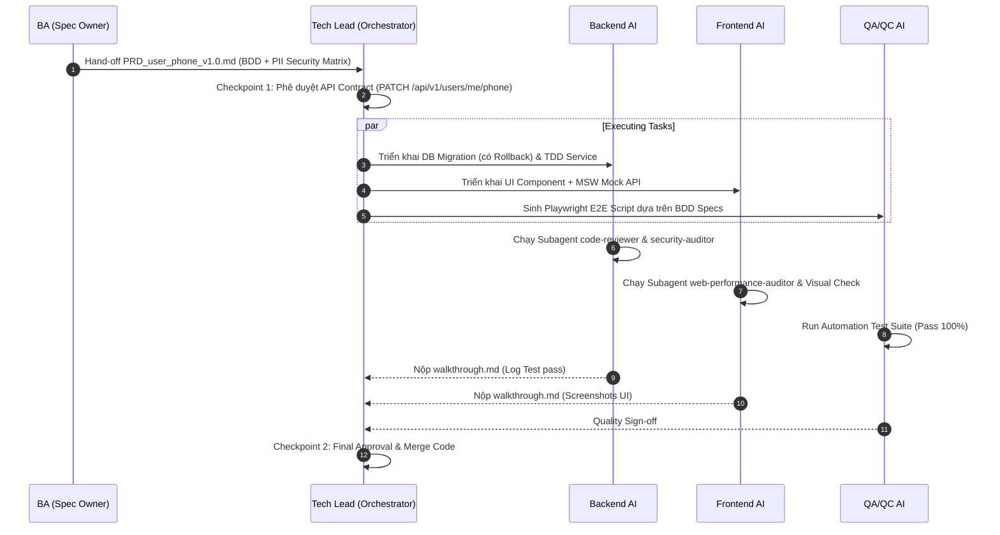
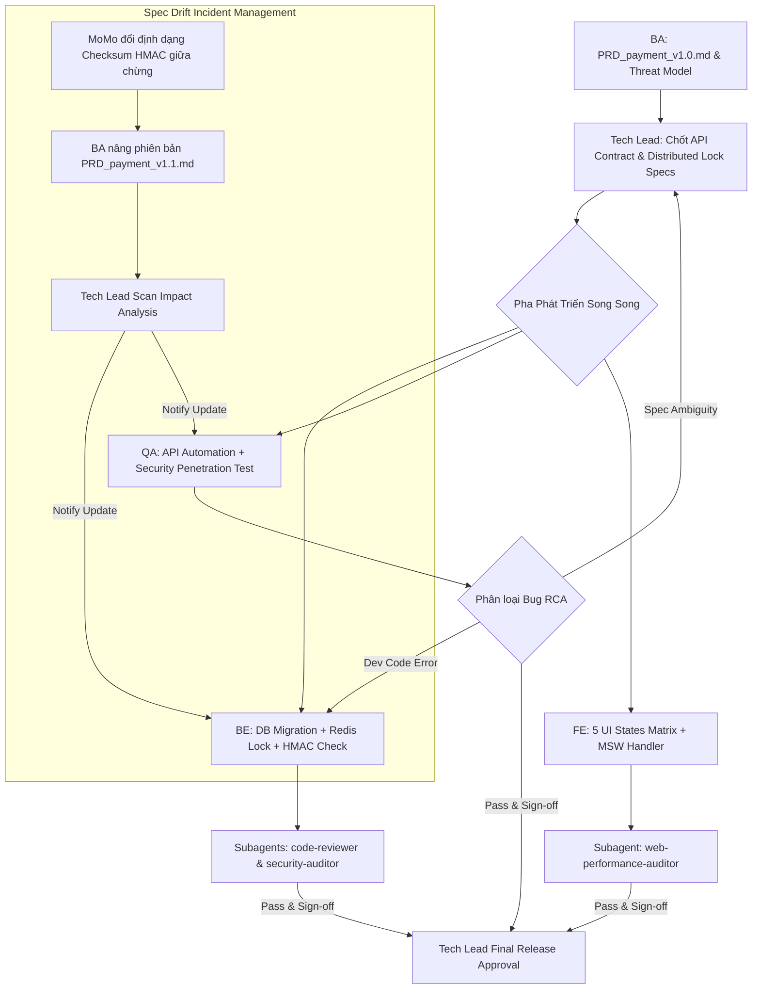

# Kịch Bản Phối Hợp & Điều Phối Luồng SDLC With AI Workflow

Tài liệu này cung cấp các kịch bản mẫu (Execution Scenarios) hướng dẫn **Tech Lead / AI Orchestrator** cách điều phối các vai trò (BA, Backend, Frontend, QA/QC) trong quá trình xử lý 1 Task đơn giản và 1 Task phức tạp.

---

## 1. Kịch Bản Task Đơn Giản (Simple Task Scenario)

### Đề bài
*Thêm trường `phoneNumber` (Số điện thoại) vào User Profile, hỗ trợ cập nhật qua API và hiển thị trên UI.*

### Các bước điều phối chi tiết
1. **Pha 1 (BA Discovery)**: BA AI Agent sinh `PRD_user_phone_v1.0.md`. Phân loại `phoneNumber` là dữ liệu `Confidential/PII` $\rightarrow$ Quy định mã hóa DB và Masking trên UI (`090****567`). Human BA duyệt.
2. **Pha 2 (Tech Lead Orchestration & Sync)**: Tech Lead AI duyệt Spec, chốt API Contract: `PATCH /api/v1/users/me/phone`. Đẩy Contract cho BE và FE.
3. **Pha 3 (Parallel Execution)**:
   - **BE Agent**: Tạo Liquibase migration (thêm column `phone_number` + script rollback) $\rightarrow$ Viết Unit Test $\rightarrow$ Viết Service.
   - **FE Agent**: Khởi tạo MSW handler mock API `PATCH /api/v1/users/me/phone` $\rightarrow$ Code UI Component (Validation + Masking).
   - **QA Agent**: Chuyển BDD Given-When-Then thành kịch bản Playwright E2E.
4. **Pha 4 (Quality Audit & Sign-off)**: BE & FE tự chạy Subagent Audit $\rightarrow$ Xuất `walkthrough.md`. QA chạy E2E Pass 100% $\rightarrow$ Sign-off. Tech Lead duyệt merge.

---

## 2. Kịch Bản Task Phức Tạp (Complex Task Scenario)

### Đề bài
*Tích hợp Cổng thanh toán MoMo / VNPay với tính năng Hoàn tiền (Refund), xử lý Idempotency (chống trùng thanh toán) và xử lý sự cố Spec Drift.*

### Các bước điều phối chi tiết

1. **Pha 1 (BA Discovery & Threat Modeling)**:
   - BA AI Agent đóng vai Adversarial Reviewer phát hiện 5 rủi ro: Webhook đến chậm, User F5/Click 2 lần, Network Timeout giữa chừng, Replay Attack.
   - Xuất `PRD_payment_v1.0.md` quy định: Header bắt buộc `Idempotency-Key`, thuật toán HMAC Signature verification.

2. **Pha 2 (Tech Lead Orchestration & API Contract Sync)**:
   - Tech Lead chốt API Contracts:
     - `POST /api/v1/payments/checkout` (Headers: `Idempotency-Key`)
     - `POST /api/v1/payments/webhook` (HMAC Signature Check)
     - `POST /api/v1/payments/refund`
   - Đẩy JSON Schema DTO sang FE (khởi tạo MSW Mock) và QA (khởi tạo REST Assured Test Suite).

3. **Pha 3 (Xử lý sự cố Spec Drift - Phản ứng linh hoạt)**:
   - *Sự cố*: Phía Cổng thanh toán thay đổi quy tắc Hash HMAC.
   - *Xử lý*: BA cập nhật `PRD_payment_v1.1.md`. Tech Lead AI Orchestrator chạy **Impact Analysis Scan** $\rightarrow$ Cảnh báo BE sửa HMAC Service và QA sửa Security API Script; FE không bị ảnh hưởng.

4. **Pha 4 (Parallel Execution & Defensive Coding)**:
   - **BE Agent**: DB Migration (Bảng `payments`, `idempotency_keys` + Rollback script) $\rightarrow$ `@Transactional`, Redis Distributed Lock chống Race Condition $\rightarrow$ Logging tuân thủ SLF4J (Không log Secret Key / Credit Card).
   - **FE Agent**: Phủ đủ 5 trạng thái UI (Form Checkout $\rightarrow$ Skeleton Loading $\rightarrow$ Payment Success $\rightarrow$ Webhook Timeout Error $\rightarrow$ Retry Dialog). Defensive rendering chống crash nếu API thiếu trường.
   - **QA Agent**: Viết Automation Script cho kịch bản Positive, Webhook Timeout, và Replay Attack (gửi 2 request trùng `Idempotency-Key`).

5. **Pha 5 (Dual-Layer Quality Audit & Cross-Role Escalation)**:
   - **BE**: Kích hoạt `security-auditor` check IDOR/Replay Attack; `code-reviewer` check N+1 query & Deadlock.
   - **FE**: Kích hoạt `web-performance-auditor` check LCP/CLS & Re-render.
   - **QA (RCA Escalation Protocol)**: Nếu Webhook fail do BE check HMAC sai $\rightarrow$ Báo RCA cho BE; nếu do BA mô tả sai thuật toán $\rightarrow$ Escalated cho Tech Lead & BA.

6. **Pha 6 (Final Approval)**:
   - BE & FE tạo `walkthrough.md` kèm logs/screenshots. QA cấp Quality Sign-off. Tech Lead duyệt Checkpoint 2 và trigger CI/CD Release.
