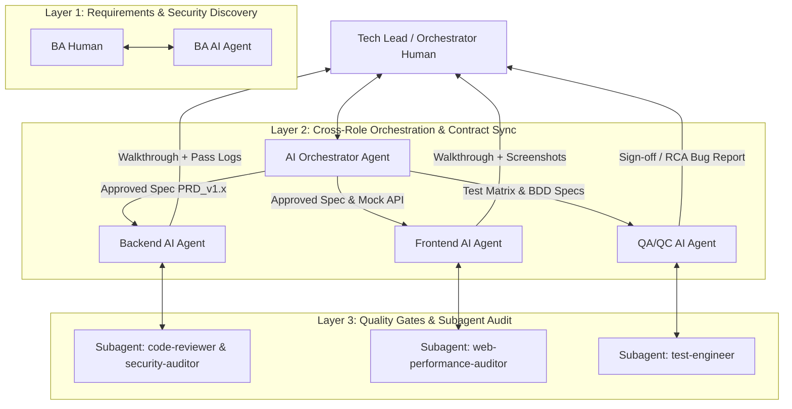

# Design Spec: Cải Tiến Toàn Diện SDLC With AI Workflow

## 1. Tổng Quan & Mục Tiêu
Nâng cấp bộ quy trình vận hành chuẩn (SOP) cho mô hình **Spec-Driven & Test-Driven SDLC** kết hợp giữa Con người (Human Engineers) và AI Agents/Subagents.
Bổ sung vai trò điều phối **Orchestrator (Tech Lead)**, chuẩn hóa cấu trúc Repository làm Context cho AI Agent, bổ sung Security & Data Privacy Matrix, và quy trình xử lý Spec Drift / Breaking Changes cross-role.

---

## 2. Kiến Trúc Mới & Phân Tầng Vai Trò (System Architecture)



---

## 3. Chi Tiết Thay Đổi Danh Mục Tài Liệu

### 3.1 [NEW] `sop_tech_lead_orchestrator.md`
- **Mục đích**: Tầng điều phối trung tâm quản lý quy trình làm việc liên vai trò (Cross-role Workflow Orchestration).
- **Quy trình chính**:
  1. **Cross-Role Sync Protocol**: Đảm bảo hợp đồng dữ liệu (API Contract) giữa BE và FE thống nhất trước khi code.
  2. **Spec Drift Management Protocol**: Xử lý khi yêu cầu thay đổi trong quá trình Dev:
     - Nâng phiên bản `PRD_v1.0.md` $\rightarrow$ `PRD_v1.1.md`.
     - Cảnh báo ảnh hưởng (Impact Analysis) đến BE, FE, và QA.
  3. **Breaking Changes & Deprecation Policy**:
     - Quy tắc gắn cờ `@Deprecated` cho API cũ.
     - Kế hoạch Rollback Migration (Liquibase/Flyway) an toàn.

### 3.2 [MODIFY] `sop_ba_ai_workflow.md`
- Bổ sung **Security & Data Privacy Matrix**: Phân loại dữ liệu (Public, Internal, Confidential, PII), quy định mã hóa và masking ngay từ khâu viết PRD.
- Bổ sung **Spec Versioning Standard**: Quy chuẩn đặt tên và quản lý phiên bản tài liệu Spec trên Git.

### 3.3 [MODIFY] `sop_backend_ai_workflow.md`
- Bổ sung **API Contract Verification Checklist**: Xác nhận DTO và HTTP Status Codes tương thích với FE trước khi merge.
- Bổ sung **Database Migration Rollback Plan**: Bắt buộc mọi script Liquibase/Flyway phải đi kèm rollback script.

### 3.4 [MODIFY] `sop_frontend_ai_workflow.md`
- Bổ sung **API Mocking & Contract Testing (MSW / Pact)**: Giúp FE chủ động phát triển và test UI khi BE API chưa hoàn thành.
- Bổ sung **Handling Breaking Changes**: Quy trình tiếp nhận API schema update từ BE mà không gây crash app.

### 3.5 [MODIFY] `sop_qa_qc_ai_workflow.md`
- Bổ sung **Automated Security Testing**: Tích hợp các kịch bản kiểm thử OWASP Top 10 vào Automation Suite.
- Bổ sung **Cross-Role Bug Escalation Protocol**: Quy trình phân loại bug (Do Dev code sai hay do BA Spec mơ hồ) và tự động tạo RCA Report.

### 3.6 [NEW] `README.md`
- Hướng dẫn tổng quan về bộ SOP và cách bootstrap cấu trúc thư mục repo chuẩn:
  ```text
  .gemini/
  ├── rules/            # Quy tắc coding chuẩn cho project
  └── skills/           # Tri thức kiến trúc tái sử dụng
  docs/
  ├── specs/            # PRDs & BDD Scenarios từ BA
  ├── test-matrices/    # Test Matrices & Scripts từ QA
  └── walkthroughs/     # Verification logs & Screenshots từ Dev/QA
  ```

---

## 4. Kế Hoạch Kiểm Trả & Nghiệm Thu (Verification Plan)
- **Tự động đối soát**: Đảm bảo tất cả các file SOP liên kết chính xác bằng markdown file links (`file://`).
- **RACI & Checklist Consistency**: Đảm bảo không có xung đột trách nhiệm giữa 5 file SOP.
