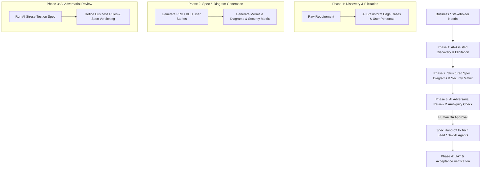

# Standard Operating Procedure (SOP): AI Agent Workflow Cho Business Analyst (BA)

## 1. Tổng Quan Vai Trò Của BA Trong AI-Driven SDLC

Trong mô hình **Spec-Driven SDLC**, **Business Analyst (BA)** đóng vai trò là **Spec Owner** và **Bridge of Truth** — chuyển đổi nhu cầu kinh doanh (ngôn ngữ con người) thành tài liệu yêu cầu cấu trúc cao, rõ ràng (**Machine-Readable Specs**) để **Dev AI Agent** và **Tester AI Agent** có thể tiếp nhận và thực thi mà không bị hiểu sai hay giả định bừa bãi.



---

## 2. RACI Matrix (Khâu Business Analysis)

| Hoạt động | Business Analyst (BA) | Product Owner / Stakeholder | AI Agent (BA Assistant) | Dev / Tester Team |
| :--- | :---: | :---: | :---: | :---: |
| **1. Requirements Elicitation** | **R / A** | **C / I** | **C** (Brainstorm Edge Cases, Persona) | **I** |
| **2. Spec & BDD Creation** | **A** | **I** | **R** (Viết Given-When-Then, Mermaid) | **C** (Review tính khả thi) |
| **3. Security & Data Privacy Matrix** | **A** | **C** (Phân loại dữ liệu) | **R** (Đề xuất mã hóa/masking rules) | **C** |
| **4. Stress-Test & Spec Versioning** | **A** | **I** | **R** (Adversarial Review & Track Version) | **C** |
| **5. Hand-off to Tech Lead / Dev AI** | **R / A** | **I** | **C** (Export Machine-Readable Spec) | **R** (Tiếp nhận vào Planning) |
| **6. UAT & Acceptance Verification** | **R / A** | **C** (Sign-off) | **R** (So sánh Walkthrough vs PRD) | **I** |

---

## 3. Chi Tiết Các Use Case BA Sử Dụng AI Agent

### Use Case 1: Trừ Khử Điểm Mơ Hồ & Tìm Điểm Mù (Ambiguity Elimination)
- **Mục tiêu**: Phát hiện các lỗ hổng nghiệp vụ, edge cases trước khi chuyển sang cho Dev.
- **Cách BA dùng AI**:
  - BA gửi nháp tính năng cho AI Agent.
  - AI Agent đóng vai **Adversarial Reviewer (Khách hàng khó tính / Hacker nghiệp vụ)** đặt ra 10-15 câu hỏi xoay quanh:
    - *Boundary values* (Giới hạn dữ liệu input).
    - *Concurrency & Race condition* (Nhiều người thao tác cùng lúc).
    - *Network failure / Timeout* (Gián đoạn kết nối khi đang thanh toán/xử lý).
    - *Data Privacy & Authorization* (Phân quyền người dùng theo vai trò).

### Use Case 2: Tự Động Sinh User Story Chuẩn BDD (Given-When-Then)
- **Mục tiêu**: Tạo ra tiêu chí nghiệm thu (Acceptance Criteria) chuẩn hóa cho cả Dev (viết Unit/Integration Test) và QA (viết E2E Test).
- **Cách BA dùng AI**:
  - Input: Mô tả luồng tính năng từ meeting note.
  - Output từ AI: Danh sách User Stories theo định dạng:
    ```gherkin
    Feature: Rút tiền tại ATM
      Scenario: Rút tiền thành công khi đủ số dư
        Given Thẻ ATM hợp lệ và số dư tài khoản là 5,000,000 VND
        When Người dùng yêu cầu rút 1,000,000 VND
        Then Hệ thống nhả tiền 1,000,000 VND
        And Số dư còn lại là 4,000,000 VND
        And Gửi tin nhắn SMS thông báo biến động số dư
    ```

### Use Case 3: Lập Ma Trận An Ninh & Bảo Mật Dữ Liệu (Security & Data Privacy Matrix)
- **Mục tiêu**: Xác định các yêu cầu tuân thủ bảo mật (PII, GDPR, Mã hóa, Masking) ngay từ bước viết Yêu cầu.
- **Cách BA dùng AI**:
  - BA dùng AI quét qua các trường dữ liệu của tính năng và xếp loại:
    - **Public**: Không nhạy cảm (Tên sản phẩm, giá bán).
    - **Internal**: Dữ liệu nội bộ (Mã đơn hàng, trạng thái kho).
    - **Confidential / PII**: Thông tin cá nhân nhạy cảm (Số CMND/CCCD, Số điện thoại, Email, Số thẻ).
  - Quy định rõ trong PRD: Trường PII nào phải **Masking khi hiển thị trên FE** (ví dụ: `090****123`) và trường nào phải **Mã hóa khi lưu DB (AES-256 / Hash)**.

### Use Case 4: Quản Lý Phiên Bản Tài Liệu (Spec Versioning Standard)
- **Mục tiêu**: Tránh Spec Drift khi thay đổi yêu cầu giữa chừng.
- **Quy chuẩn**:
  - Tên file lưu trong repo: `docs/specs/PRD_<feature_name>_v<major>.<minor>.md` (Ví dụ: `PRD_payment_gateway_v1.1.md`).
  - Mọi thay đổi đều phải ghi nhận vào bảng **Revision History** ở đầu file Spec:
    | Version | Ngày | Tác giả | Nội dung thay đổi | Ảnh hưởng (BE/FE/QA) |
    | :---: | :---: | :---: | :--- | :--- |
    | v1.0 | 2026-07-20 | BA Team | Khởi tạo Spec rút tiền | N/A |
    | v1.1 | 2026-07-22 | BA Team | Bổ sung OTP xác thực 2 lớp | BE: thêm OTP API; FE: thêm UI OTP; QA: thêm Test Case OTP |

---

## 4. Quy Trình 4 Bước Cụ Thể Cho BA (BA Workflow Steps)

### Step 1: Input & Brainstorming (Pha Khởi Tạo)
BA tiếp nhận đề bài từ PO/Khách hàng $\rightarrow$ Kích hoạt AI với Prompt mẫu:
> *"Tôi sắp làm tính năng [Tên tính năng]. Hãy đóng vai là Senior Product Analyst, liệt kê 10 edge cases nghiệp vụ nguy hiểm nhất và 5 rủi ro về phân quyền/dữ liệu cần làm rõ."*

### Step 2: Spec Construction (Pha Soạn Thảo Spec)
BA duyệt qua kết quả AI brainstorm, chốt phương án $\rightarrow$ Ra lệnh cho AI tạo file `PRD_feature_name_v1.0.md` theo cấu trúc:
1. **Revision History & Document Version**
2. **Objective & User Value**
3. **User Stories & BDD Acceptance Criteria**
4. **Security & Data Privacy Matrix (PII Masking & Encryption Rules)**
5. **Business Rules & Validations**
6. **Mermaid Diagrams (Flowchart & Sequence)**
7. **Data Dictionary / Form Fields Spec**

### Step 3: AI Adversarial Review (Pha Stress-Test Spec)
BA chạy câu lệnh kiểm định trên file Spec vừa hoàn thành:
> *"Hãy kiểm tra tài liệu PRD này. Có logic nào bị mâu thuẫn không? Có trường hợp ngoại lệ nào chưa được quy định rõ cách xử lý không?"*

### Step 4: Hand-off to Tech Lead & Dev AI Agent (Pha Bàn Giao)
Tài liệu PRD hoàn chỉnh được lưu vào thư mục `docs/specs/` của Repository. **Tech Lead** và **Dev AI Agent** ở Pha 1 (Planning Stage) sẽ đọc trực tiếp file này làm đầu vào để lập `implementation_plan.md`.

---

## 5. Checklist Kiểm Duyệt Của BA (BA Quality Gate)

> [!IMPORTANT]
> **BA Spec Hand-off Checklist (Trước khi giao cho Tech Lead / Dev)**
> - [ ] Đánh số phiên bản tài liệu chuẩn (`PRD_feature_v1.x.md`) và cập nhật bảng Revision History.
> - [ ] 100% User Story có BDD Acceptance Criteria (Given-When-Then).
> - [ ] Đã hoàn thiện **Security & Data Privacy Matrix** (rõ trường PII, quy tắc Masking/Encryption).
> - [ ] Đã định nghĩa đầy đủ các trạng thái dữ liệu (Valid, Invalid, Boundary).
> - [ ] Sơ đồ Mermaid Sequence Diagram thể hiện rõ luồng tương tác.
> - [ ] Đã qua bước AI Stress-Test và xử lý hết các câu hỏi mơ hồ.
> - [ ] File `PRD.md` được lưu vào Git Repository tại `docs/specs/` để Dev AI Agent truy cập trực tiếp.
