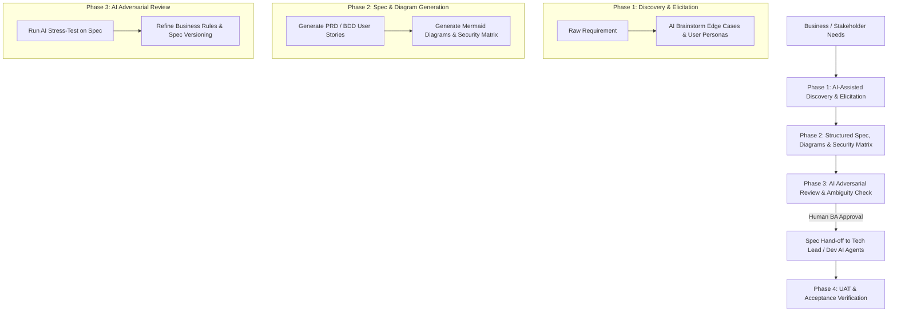

# Standard Operating Procedure (SOP): AI Agent Workflow Cho Business Analyst (BA)

> [!NOTE]
> **PLATFORM AGNOSTIC NOTICE**
> Tài liệu này được thiết kế độc lập với nền tảng AI. Hướng dẫn áp dụng nhất quán cho bất kỳ AI Agent nào (Antigravity, Claude Code, Cursor, Windsurf, Copilot, v.v.).

## 1. Tổng Quan Vai Trò Của BA Trong AI-Driven SDLC

Trong mô hình **Spec-Driven SDLC**, **Business Analyst (BA)** đóng vai trò là **Spec Owner** và **Bridge of Truth** — chuyển đổi nhu cầu kinh doanh (ngôn ngữ con người) thành tài liệu yêu cầu cấu trúc cao, rõ ràng (**Machine-Readable Specs**) để **Dev AI Agent** và **Tester AI Agent** có thể tiếp nhận và thực thi mà không bị hiểu sai hay giả định bừa bãi.

---

## 2. RACI Matrix (Khâu Business Analysis)

| Hoạt động | Business Analyst (BA) | Product Owner / Stakeholder | AI Agent (BA Assistant) | Dev / Tester Team |
| :--- | :---: | :---: | :---: | :---: |
| **1. Requirements Elicitation** | **R / A** | **C / I** | **C** (Brainstorm Edge Cases, Persona) | **I** |
| **2. Spec & BDD Creation** | **A** | **I** | **R** (Viết Given-When-Then, Mermaid) | **C** (Review tính khả thi) |
| **3. Security & Data Privacy Matrix** | **A** | **C** (Phân loại dữ liệu) | **R** (Đề xuất mã hóa/masking rules) | **C** |
| **4. Stress-Test & Spec Versioning** | **A** | **I** | **R** (Adversarial Review & Track Version) | **C** |
| **5. Hand-off to Tech Lead / Dev AI** | **R / A** | **I** | **C** (Export Machine-Readable Spec) | **R** (Tiếp nhận vào Planning) |
| **6. UAT & Acceptance Verification** | **R / A** | **C** (Sign-off) | **R** (So sánh Walkthrough vs PRD) | **I** |

---

## 3. Chi Tiết Các Use Case BA Sử Dụng AI Agent

### Use Case 1: Trừ Khử Điểm Mơ Hồ & Tìm Điểm Mù (Ambiguity Elimination)
- **Mục tiêu**: Phát hiện các lỗ hổng nghiệp vụ, edge cases trước khi chuyển sang cho Dev.
- **Cách BA dùng AI**:
  - BA gửi nháp tính năng cho AI Agent.
  - AI Agent đóng vai **Adversarial Reviewer (Khách hàng khó tính / Hacker nghiệp vụ)** đặt ra 10-15 câu hỏi xoay quanh:
    - *Boundary values* (Giới hạn dữ liệu input).
    - *Concurrency & Race condition* (Nhiều người thao tác cùng lúc).
    - *Network failure / Timeout* (Gián đoạn kết nối khi đang thanh toán/xử lý).
    - *Data Privacy & Authorization* (Phân quyền người dùng theo vai trò).

### Use Case 2: Tự Động Sinh User Story Chuẩn BDD (Given-When-Then)
- **Mục tiêu**: Tạo ra tiêu chí nghiệm thu (Acceptance Criteria) chuẩn hóa cho cả Dev (viết Unit/Integration Test) và QA (viết E2E Test).
- **Cách BA dùng AI**:
  - Input: Mô tả luồng tính năng từ meeting note.
  - Output từ AI: Danh sách User Stories theo định dạng Given-When-Then.

### Use Case 3: Lập Ma Trận An Ninh & Bảo Mật Dữ Liệu (Security & Data Privacy Matrix)
- **Mục tiêu**: Xác định các yêu cầu tuân thủ bảo mật (PII, GDPR, Mã hóa, Masking) ngay từ bước viết Yêu cầu.
- **Cách BA dùng AI**:
  - BA dùng AI quét qua các trường dữ liệu của tính năng và xếp loại: Public, Internal, Confidential / PII.
  - Quy định rõ trong PRD trường nào phải **Masking khi hiển thị trên FE** và trường nào phải **Mã hóa khi lưu DB**.

### Use Case 4: Quản Lý Phiên Bản Tài Liệu (Spec Versioning Standard)
- **Mục tiêu**: Tránh Spec Drift khi thay đổi yêu cầu giữa chừng.
- **Quy chuẩn**: Tên file `docs/specs/PRD_<feature_name>_v<major>.<minor>.md` kèm bảng Revision History.

---

## 4. Công Cụ Hỗ Trợ: Recommended Skills & MCP Servers Cho BA

### MCP Servers Ưu Tiên:
- **`jira` / `confluence`**: Đọc/tạo Epic, User Story, PRDs và nhận meeting notes trực tiếp từ Jira/Confluence.
- **`github` / `gitlab`**: Quản lý file `PRD.md` trên repository và link issue với ticket.

### Skills Quy Trình Ưu Tiên:
- **`brainstorming`**: Khai phá ý tưởng, đào sâu mục đích kinh doanh, tìm điểm mù nghiệp vụ qua phỏng vấn 1-câu-hỏi.
- **`spec-driven-development`**: Thiết lập specs chuẩn machine-readable trước khi viết bất kỳ plan hoặc code nào.
- **`api-and-interface-design`**: Định hình hợp đồng dữ liệu ban đầu cho các module.

---

## 5. Checklist Kiểm Duyệt Của BA (BA Quality Gate)

> [!IMPORTANT]
> **BA Spec Hand-off Checklist (Trước khi giao cho Tech Lead / Dev)**
> - [ ] Đánh số phiên bản tài liệu chuẩn (`PRD_feature_v1.x.md`) và cập nhật bảng Revision History.
> - [ ] 100% User Story có BDD Acceptance Criteria (Given-When-Then).
> - [ ] Đã hoàn thiện **Security & Data Privacy Matrix** (rõ trường PII, quy tắc Masking/Encryption).
> - [ ] Đã định nghĩa đầy đủ các trạng thái dữ liệu (Valid, Invalid, Boundary).
> - [ ] Sơ đồ Mermaid Sequence Diagram thể hiện rõ luồng tương tác.
> - [ ] Đã qua bước AI Stress-Test và xử lý hết các câu hỏi mơ hồ.
> - [ ] File `PRD.md` được lưu vào Git Repository tại `docs/specs/` để Dev AI Agent truy cập trực tiếp.
