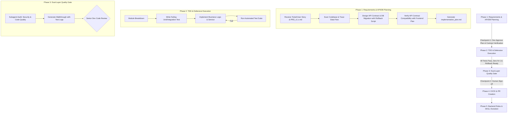

# Standard Operating Procedure (SOP): AI Agent Workflow Cho Backend (BE) Development

## 1. Tổng Quan Mô Hình Workflow Backend

Tài liệu này quy định quy trình chuẩn (SOP) dành riêng cho **Backend Development**, áp dụng triết lý **Spec-Driven & Test-Driven Development (TDD)** giữa **Tech Lead/Senior Backend Engineer (Human)** và **AI Agent**.



---

## 2. RACI Matrix (Backend Team)

| Pha SDLC | Tech Lead / Senior BE | AI Agent | Subagent (Code Reviewer / Security Auditor) |
| :--- | :---: | :---: | :---: |
| **1. Planning & Design** | **A / I** (Phê duyệt API/DB Plan) | **R** (Solution Architect, Lập Plan & Verify Contract) | - |
| **2. TDD & Coding** | **A** (Kiểm soát tiến độ & Kiến trúc) | **R** (Viết Service, Repo, Controller, Rollback & Tests) | - |
| **3. Verification & Review** | **A** (Duyệt merge) | **R** (Tạo Walkthrough, Chạy test pass) | **C** (Audit N+1 query, Security, SOLID) |
| **4. Deployment & Ops** | **R / A** (Trigger CI/CD release) | **C** (Hỗ trợ phân tích log build/deploy) | - |
| **5. Rules Evolution** | **A** (Phê duyệt quy tắc mới) | **R** (Cập nhật backend_guidelines.md) | - |

---

## 3. Chi Tiết Các Pha Thực Thi (Backend Workflow)

### Phase 1: Requirements & API/DB Planning (Spec-Driven Stage)
- **Role AI Agent**: Backend Solution Architect.
- **Quy trình chi tiết**:
  1. **Codebase Exploration**: AI dùng `grep_search` và `view_file` để trace luồng dữ liệu (Controller $\rightarrow$ Service $\rightarrow$ Repository $\rightarrow$ Database Entity).
  2. **API & Database Contract Specification**:
     - Định nghĩa API Request/Response DTOs (validation annotations `@NotNull`, `@Valid`).
     - Định nghĩa Database Migration Schema (Liquibase XML / Flyway SQL). Bắt buộc 100% script migration phải có **Rollback Plan** đi kèm.
     - **API Contract Verification**: Kiểm tra đối soát định dạng JSON DTOs và HTTP Status Codes với Frontend UI Plan để đảm bảo không bị sai lệch kiểu dữ liệu hoặc tên trường.
  3. **Plan Artifact**: Xuất `implementation_plan.md` liệt kê danh sách file ảnh hưởng (`[MODIFY]`, `[NEW]`, `[DELETE]`).
  4. **Checkpoint 1 (Human Approval)**: Dev duyệt Plan trước khi AI được phép ghi code.

### Phase 2: Test-Driven & Defensive Execution
- **Role AI Agent**: Senior Backend Developer.
- **Quy trình chi tiết**:
  1. **Red-Green-Refactor (TDD)**:
     - Viết Unit Test (JUnit 5 + Mockito) chứng minh lỗi/chưa có tính năng (Red).
     - Triển khai logic nghiệp vụ tối thiểu trong Service/Repository để Test pass (Green).
     - Refactor nâng cao hiệu năng và độ đọc hiểu.
  2. **Defensive Programming Standards**:
     - Phòng chống **N+1 Query** (sử dụng `@EntityGraph`, JOIN FETCH, hoặc QueryDSL).
     - Quản lý **Database Transaction Boundaries** (`@Transactional(readOnly = true)` cho query, write transaction hợp lý).
     - Quản lý **Resource Lifecycles** (Đóng connection, stream, handle async thread pool deadlocks).
  3. **Structured Logging**: Đảm bảo dùng SLF4J placeholders (`logger.info("Processing orderId={}", orderId)`), không dùng String concatenation hoặc `System.out.println`.
  4. **Verification Step**: Chạy test suite bằng lệnh (`mvn test`, `gradle test`, `pytest`) sau mỗi module.

### Phase 3: Dual-Layer Quality Gate & Review
- **Role AI Agent**: Code Auditor & Security Specialist.
- **Quy trình chi tiết**:
  1. **Layer 1 - Subagent Self-Audit**:
     - Kích hoạt `code-reviewer` rà soát SOLID, Code Duplication và N+1 query.
     - Kích hoạt `security-auditor` kiểm tra OWASP Top 10 (SQL Injection, IDOR, Parameter Tampering, Hardcoded secrets).
  2. **Walkthrough Artifact Creation**: Tạo `walkthrough.md` tổng hợp:
     - Diff tóm tắt các thay đổi backend.
     - Bằng chứng test execution log (100% unit & integration test pass).
  3. **Checkpoint 2 (Final Human Review)**: Senior Dev kiểm tra diff và sign-off.

### Phase 4: CI/CD & Deployment Readiness
- **Role AI Agent**: DevOps Assistant.
- **Quy trình chi tiết**:
  1. Chạy static code analysis (Linter / SonarQube rules).
  2. Đảm bảo zero breaking changes trên API public contracts.
  3. Commit với Conventional Commits (ví dụ: `feat(order): add idempotency key check to payment API`).

### Phase 5: Repo-as-Context & Rules Evolution
- **Role AI Agent**: Backend Maintainer.
- **Cấu trúc lưu trữ context trong Repository**:
  ```text
  .gemini/
  ├── rules/
  │   ├── backend_guidelines.md       # Standard SOLID, SLF4J, Transaction Management
  │   ├── database_standards.md       # JPA/Hibernate, Indexing, Liquibase/Flyway rules
  │   └── security_rules.md           # OWASP Backend, JWT Validation, Sanitization
  └── skills/
      ├── project-architecture/       # Sơ đồ phân tầng Controller-Service-Repository
      └── unit-testing/               # Chuẩn JUnit 5, Mockito, Testcontainers patterns
  ```

---

## 4. Checklist Kiểm Duyệt Backend (Quality Gates)

> [!IMPORTANT]
> **Checkpoint 1: Plan Approval Checklist**
> - [ ] API Contract (Request/Response DTOs, HTTP Status Codes) khớp 100% với Frontend Contract Plan.
> - [ ] Database Migration scripts (Liquibase/Flyway) có tính khôi phục (Rollback plan đi kèm).
> - [ ] Quản lý Transaction boundaries và Isolation level hợp lý.
> - [ ] Phân tích đầy đủ edge cases và error response codes.

> [!CHECK]
> **Checkpoint 2: Code Review Sign-off Checklist**
> - [ ] 100% Unit Test & Integration Test pass.
> - [ ] Không có câu lệnh SQL/JPA bị dính N+1 query.
> - [ ] Không leak resource, không nuốt exception (empty catch block).
> - [ ] Logging tuân thủ SLF4J placeholder, không log dữ liệu nhạy cảm (Password, Token, PII).
> - [ ] Đã qua rà soát của Subagent `code-reviewer` và `security-auditor`.
