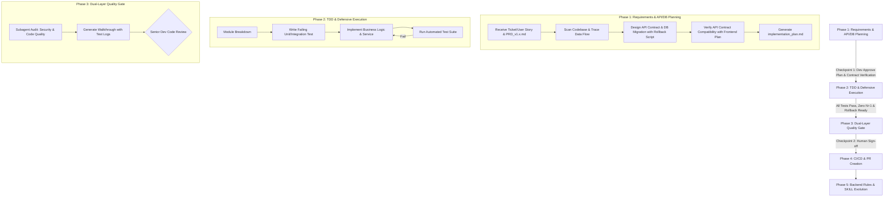

# Standard Operating Procedure (SOP): AI Agent Workflow Cho Backend (BE) Development

> [!NOTE]
> **PLATFORM AGNOSTIC NOTICE**
> Tài liệu này được thiết kế độc lập với nền tảng AI. Hướng dẫn áp dụng nhất quán cho bất kỳ AI Agent nào (Antigravity, Claude Code, Cursor, Windsurf, Copilot, v.v.).

## 1. Tổng Quan Mô Hình Workflow Backend

Tài liệu này quy định quy trình chuẩn (SOP) dành riêng cho **Backend Development**, áp dụng triết lý **Spec-Driven & Test-Driven Development (TDD)** giữa **Tech Lead/Senior Backend Engineer (Human)** và **AI Agent**.

---

## 2. RACI Matrix (Backend Team)

| Pha SDLC | Tech Lead / Senior BE | AI Agent | Subagent (Code Reviewer / Security Auditor) |
| :--- | :---: | :---: | :---: |
| **1. Planning & Design** | **A / I** (Phê duyệt API/DB Plan) | **R** (Solution Architect, Lập Plan & Verify Contract) | - |
| **2. TDD & Coding** | **A** (Kiểm soát tiến độ & Kiến trúc) | **R** (Viết Service, Repo, Controller, Rollback & Tests) | - |
| **3. Verification & Review** | **A** (Duyệt merge) | **R** (Tạo Walkthrough, Chạy test pass) | **C** (Audit N+1 query, Security, SOLID) |
| **4. Deployment & Ops** | **R / A** (Trigger CI/CD release) | **C** (Hỗ trợ phân tích log build/deploy) | - |
| **5. Rules Evolution** | **A** (Phê duyệt quy tắc mới) | **R** (Cập nhật backend_guidelines.md) | - |

---

## 3. Chi Tiết Các Pha Thực Thi (Backend Workflow)

### Phase 1: Requirements & API/DB Planning (Spec-Driven Stage)
- **Role AI Agent**: Backend Solution Architect.
- **Quy trình chi tiết**:
  1. **Codebase Exploration**: AI trace luồng dữ liệu (Controller $\rightarrow$ Service $\rightarrow$ Repository $\rightarrow$ Database Entity).
  2. **API & Database Contract Specification**:
     - Định nghĩa API Request/Response DTOs (`@NotNull`, `@Valid`).
     - Định nghĩa Database Migration Schema (Liquibase XML / Flyway SQL) **kèm Rollback Plan bắt buộc**.
     - **API Contract Verification**: Kiểm tra đối soát định dạng JSON DTOs với Frontend UI Plan.
  3. **Plan Artifact**: Xuất `implementation_plan.md`.
  4. **Checkpoint 1 (Human Approval)**: Dev duyệt Plan trước khi AI được phép ghi code.

### Phase 2: Test-Driven & Defensive Execution
- **Role AI Agent**: Senior Backend Developer.
- **Quy trình chi tiết**:
  1. **Red-Green-Refactor (TDD)**: Viết failing Unit Test trước $\rightarrow$ Code tối thiểu $\rightarrow$ Pass Test $\rightarrow$ Refactor.
  2. **Defensive Programming Standards**: Chống N+1 Query (`@EntityGraph`), quản lý Transaction boundaries, đóng connection/stream.
  3. **Structured Logging**: Tuân thủ SLF4J placeholders (`logger.info("Processing orderId={}", orderId)`).

### Phase 3: Dual-Layer Quality Gate & Review
- **Role AI Agent**: Code Auditor & Security Specialist.
- **Quy trình chi tiết**:
  1. **Layer 1 - Subagent Self-Audit**: Rà soát SOLID, N+1 query, và OWASP Top 10.
  2. **Walkthrough Artifact Creation**: Tạo `walkthrough.md` đính kèm log test pass 100%.

---

## 4. Công Cụ Hỗ Trợ: Recommended Skills & MCP Servers Cho Backend

### MCP Servers Ưu Tiên:
- **`mysql` / `postgresql`**: Kết nối kiểm tra trực tiếp database schema, index, và chạy thử migration.
- **`github` / `gitlab`**: Push branch, tạo Pull Request và kiểm tra CI build status.
- **`context7`**: Tra cứu tài liệu chính thức của Spring Boot, Hibernate, Quarkus, NestJS, SQLAlchemy, v.v.

### Skills Quy Trình Ưu Tiên:
- **`test-driven-development`**: Thực thi chu trình Red-Green-Refactor khắt khe.
- **`backend-architect` / `architecture-patterns`**: Áp dụng Clean/Hexagonal Architecture, Repository pattern, DTO mapping.
- **`backend-security-coder`**: Viết code chống SQL Injection, IDOR, Parameter Tampering, Hardcoded secrets.
- **`performance-optimization`**: Tối ưu N+1 query, Caching strategy, Connection pool.

---

## 5. Checklist Kiểm Duyệt Backend (Quality Gates)

> [!IMPORTANT]
> **Checkpoint 1: Plan Approval Checklist**
> - [ ] API Contract (Request/Response DTOs, HTTP Status Codes) khớp 100% với Frontend Contract Plan.
> - [ ] Database Migration scripts (Liquibase/Flyway) có tính khôi phục (Rollback plan đi kèm).
> - [ ] Quản lý Transaction boundaries và Isolation level hợp lý.

> [!CHECK]
> **Checkpoint 2: Code Review Sign-off Checklist**
> - [ ] 100% Unit Test & Integration Test pass.
> - [ ] Không có câu lệnh SQL/JPA bị dính N+1 query.
> - [ ] Logging tuân thủ SLF4J placeholder, không log dữ liệu nhạy cảm (Password, Token, PII).
> - [ ] Đã qua rà soát của Subagent `code-reviewer` và `security-auditor`.
