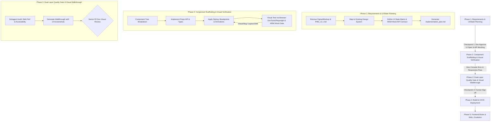

# Standard Operating Procedure (SOP): AI Agent Workflow Cho Frontend (FE) Development

## 1. Tổng Quan Mô Hình Workflow Frontend

Tài liệu này quy định quy trình chuẩn (SOP) dành riêng cho **Frontend Development**, áp dụng triết lý **Spec-Driven, Visual & Test-Driven Development** giữa **Tech Lead/Senior Frontend Engineer (Human)** và **AI Agent**.



---

## 2. RACI Matrix (Frontend Team)

| Pha SDLC | Tech Lead / Senior FE | AI Agent | Subagent (Web Perf Auditor / Code Reviewer) |
| :--- | :---: | :---: | :---: |
| **1. Planning & Design** | **A / I** (Phê duyệt UI/State Spec) | **R** (Frontend Architect, Lập Plan & Setup MSW Mock) | - |
| **2. Coding & Verification** | **A** (Kiểm soát tiến độ & UX) | **R** (Code Component, Styling, Hooks & Visual Check) | - |
| **3. Verification & Review** | **A** (Duyệt merge & Visual Sign-off) | **R** (Tạo Walkthrough kèm UI Screenshots) | **C** (Audit Core Web Vitals, A11y, Bundle size) |
| **4. Deployment & Ops** | **R / A** (Trigger release build) | **C** (Kiểm tra bundle analyzer & static export) | - |
| **5. Rules Evolution** | **A** (Phê duyệt chuẩn UI/UX mới) | **R** (Cập nhật frontend_guidelines.md) | - |

---

## 3. Chi Tiết Các Pha Thực Thi (Frontend Workflow)

### Phase 1: Requirements & UI/State Planning (Spec-Driven Stage)
- **Role AI Agent**: Frontend Architect & UI Analyst.
- **Quy trình chi tiết**:
  1. **Design System & Component Audit**: AI dùng `grep_search` quét thư mục components (`src/components/ui`) để tối đa hóa việc tái sử dụng UI tokens và Shadcn/Radix/Tailwind components.
  2. **API Contract Verification & Mock Setup**:
     - Đối soát DTO của Backend plan với UI State Matrix.
     - Thiết lập ngay **Mock Service Worker (MSW)** hoặc **Pact contract handlers** (`src/mocks/handlers.ts`) dựa trên API Contract chốt ở Pha 1, giúp Frontend lập trình và test UI mượt mà ngay cả khi Backend API chưa khởi tạo xong.
  3. **UI State Matrix Specification**: Quy định rõ trong `implementation_plan.md` 5 trạng thái giao diện cơ bản:
     - `Idle / Initial State`: Chưa kích hoạt action.
     - `Loading State`: Skeleton loader phù hợp với layout, ngăn ngừa Layout Shift (CLS).
     - `Success / Data Rendered State`: Hiển thị đúng dữ liệu thực tế.
     - `Error State`: Toast notification hoặc Inline Alert thông báo rõ lỗi cho người dùng.
     - `Empty State`: Giao diện thân thiện khi danh sách/dữ liệu rỗng.
  4. **Checkpoint 1 (Human Approval)**: Dev duyệt Plan trước khi AI triển khai code.

### Phase 2: Component Scaffolding & Visual Verification
- **Role AI Agent**: Senior Frontend Developer.
- **Quy trình chi tiết**:
  1. **Type-Safe Component Architecture & Graceful Fallbacks**:
     - Định nghĩa TypeScript interfaces rõ ràng cho Props.
     - Xử lý **Breaking Changes / Defensive UI Rendering**: Kiểm tra optional chaining (`data?.user?.name ?? 'Guest'`) phòng ngừa vỡ app khi Backend trả về null hoặc thiếu trường.
  2. **Responsive & Micro-animations**: Áp dụng Mobile-first responsive design (`sm:`, `md:`, `lg:`, `xl:`) và Micro-animations.
  3. **Visual Verification (Bắt buộc cho FE)**:
     - Sử dụng công cụ tương tác trình duyệt (Chrome DevTools / Playwright) để kiểm tra DOM thực tế trên MSW Mock Data.
     - Kiểm tra Console Log đảm bảo 0 lỗi/warning về React hydration, duplicate keys, hay unhandled rejections.

### Phase 3: Dual-Layer Quality Gate & Visual Walkthrough
- **Role AI Agent**: UI Auditor & QA Engineer.
- **Quy trình chi tiết**:
  1. **Layer 1 - Subagent Self-Audit**:
     - Kích hoạt `web-performance-auditor` rà soát **Core Web Vitals**: LCP, CLS, INP và re-render performance.
     - Kích hoạt `code-reviewer` kiểm tra memory leak trong `useEffect` hoặc event listeners.
  2. **Walkthrough Artifact Creation**: Tạo `walkthrough.md` đính kèm hình ảnh Screenshot thực tế thu được từ kiểm thử trình duyệt.

### Phase 4: CI/CD & Production Build
- **Role AI Agent**: Frontend Build Assistant.
- **Quy trình chi tiết**:
  1. Chạy `tsc --noEmit` để đảm bảo không còn lỗi TypeScript.
  2. Chạy `npm run build` xác nhận zero build error và phân tích Bundle size.

### Phase 5: Repo-as-Context & Rules Evolution
- **Role AI Agent**: Frontend System Maintainer.
- **Cấu trúc lưu trữ context trong Repository**:
  ```text
  .gemini/
  ├── rules/
  │   ├── frontend_guidelines.md      # Standard Component Structure, State Management, Styling
  │   └── security_rules.md           # XSS Sanitization, CSP Headers, Token Storage
  └── skills/
      ├── project-architecture/       # Sơ đồ phân tầng Component Tree & Hook Layer
      └── ui-styling/                 # Hướng dẫn Tailwind CSS, Design Tokens
  ```

---

## 4. Checklist Kiểm Duyệt Frontend (Quality Gates)

> [!IMPORTANT]
> **Checkpoint 1: Plan Approval Checklist**
> - [ ] Khớp API Contract với BE và đã khởi tạo MSW Mock Service Handlers.
> - [ ] Đã phủ đủ 5 trạng thái UI (Idle, Loading, Success, Error, Empty).
> - [ ] Component Tree và Props API tuân thủ Design System dự án.
> - [ ] Xác định các điểm breakpoints responsive màn hình (Mobile/Tablet/Desktop).

> [!CHECK]
> **Checkpoint 2: Code Review Sign-off Checklist**
> - [ ] Giao diện hiển thị đúng mockup/design tokens, không vỡ layout trên mobile.
> - [ ] Defensive Rendering chống vỡ giao diện khi API bị thiếu trường dữ liệu.
> - [ ] 0 Console error/warning trên DevTools.
> - [ ] Walkthrough đính kèm đầy đủ hình ảnh/screenshot thực tế của UI.
> - [ ] Đạt chuẩn truy cập WCAG 2.1 AA.
> - [ ] Đã qua rà soát của Subagent `web-performance-auditor`.
