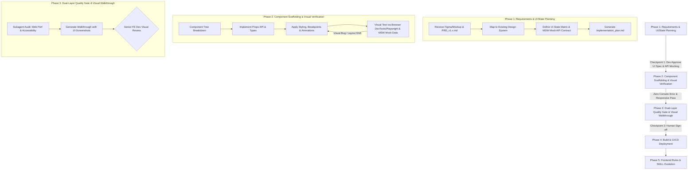

# Standard Operating Procedure (SOP): AI Agent Workflow Cho Frontend (FE) Development

> [!NOTE]
> **PLATFORM AGNOSTIC NOTICE**
> Tài liệu này được thiết kế độc lập với nền tảng AI. Hướng dẫn áp dụng nhất quán cho bất kỳ AI Agent nào (Antigravity, Claude Code, Cursor, Windsurf, Copilot, v.v.).

## 1. Tổng Quan Mô Hình Workflow Frontend

Tài liệu này quy định quy trình chuẩn (SOP) dành riêng cho **Frontend Development**, áp dụng triết lý **Spec-Driven, Visual & Test-Driven Development** giữa **Tech Lead/Senior Frontend Engineer (Human)** và **AI Agent**.

---

## 2. RACI Matrix (Frontend Team)

| Pha SDLC | Tech Lead / Senior FE | AI Agent | Subagent (Web Perf Auditor / Code Reviewer) |
| :--- | :---: | :---: | :---: |
| **1. Planning & Design** | **A / I** (Phê duyệt UI/State Spec) | **R** (Frontend Architect, Lập Plan & Setup MSW Mock) | - |
| **2. Coding & Verification** | **A** (Kiểm soát tiến độ & UX) | **R** (Code Component, Styling, Hooks & Visual Check) | - |
| **3. Verification & Review** | **A** (Duyệt merge & Visual Sign-off) | **R** (Tạo Walkthrough kèm UI Screenshots) | **C** (Audit Core Web Vitals, A11y, Bundle size) |
| **4. Deployment & Ops** | **R / A** (Trigger release build) | **C** (Kiểm tra bundle analyzer & static export) | - |
| **5. Rules Evolution** | **A** (Phê duyệt chuẩn UI/UX mới) | **R** (Cập nhật frontend_guidelines.md) | - |

---

## 3. Chi Tiết Các Pha Thực Thi (Frontend Workflow)

### Phase 1: Requirements & UI/State Planning (Spec-Driven Stage)
- **Role AI Agent**: Frontend Architect & UI Analyst.
- **Quy trình chi tiết**:
  1. **Design System & Component Audit**: AI quét thư mục components để tái sử dụng UI tokens và Shadcn/Radix/Tailwind components.
  2. **API Contract Verification & Mock Setup**: Thiết lập ngay **Mock Service Worker (MSW)** hoặc Pact handlers (`src/mocks/handlers.ts`) dựa trên API Contract chốt ở Pha 1.
  3. **UI State Matrix Specification**: Quy định rõ trong `implementation_plan.md` 5 trạng thái giao diện: Idle, Loading, Success, Error, Empty.

### Phase 2: Component Scaffolding & Visual Verification
- **Role AI Agent**: Senior Frontend Developer.
- **Quy trình chi tiết**:
  1. **Type-Safe & Defensive Rendering**: TypeScript Props interface + optional chaining (`data?.user?.name ?? 'Guest'`) tránh vỡ app.
  2. **Responsive & Micro-animations**: Mobile-first responsive (`sm:`, `md:`, `lg:`) và micro-animations.
  3. **Visual Verification**: Sử dụng công cụ tương tác trình duyệt (DevTools / Playwright) để kiểm tra DOM thực tế trên MSW Mock Data. 0 console error.

### Phase 3: Dual-Layer Quality Gate & Visual Walkthrough
- **Role AI Agent**: UI Auditor & QA Engineer.
- **Quy trình chi tiết**:
  1. **Layer 1 - Subagent Self-Audit**: Audit **Core Web Vitals**: LCP, CLS, INP và accessibility (WCAG 2.1 AA).
  2. **Walkthrough Artifact Creation**: Tạo `walkthrough.md` đính kèm hình ảnh Screenshot thực tế.

---

## 4. Công Cụ Hỗ Trợ: Recommended Skills & MCP Servers Cho Frontend

### MCP Servers Ưu Tiên:
- **`playwright`**: Chạy headless browser, chụp ảnh màn hình verification, kiểm thử tương tác UI và layout diff.
- **`context7`**: Tra cứu tài liệu chuẩn của React 19, Next.js, Tailwind CSS, Zustand, Shadcn/Radix UI.
- **`github` / `gitlab`**: Push branch UI, tạo PR và kiểm tra Vercel/Netlify preview deployment.

### Skills Quy Trình Ưu Tiên:
- **`frontend-developer` / `frontend-ui-engineering`**: Xây dựng React/Next.js components chuẩn accessible, responsive.
- **`ui-styling` / `ui-ux-pro-max`**: Áp dụng design tokens, Tailwind CSS utility classes, glassmorphism, HSL color palette.
- **`frontend-security-coder`**: Phòng chống XSS bằng DOMPurify, CSP headers, an toàn token storage.
- **`browser-testing-with-devtools`**: Bắt lỗi console, network payload và inspect DOM thực tế.

---

## 5. Checklist Kiểm Duyệt Frontend (Quality Gates)

> [!IMPORTANT]
> **Checkpoint 1: Plan Approval Checklist**
> - [ ] Khớp API Contract với BE và đã khởi tạo MSW Mock Service Handlers.
> - [ ] Đã phủ đủ 5 trạng thái UI (Idle, Loading, Success, Error, Empty).
> - [ ] Component Tree và Props API tuân thủ Design System dự án.

> [!CHECK]
> **Checkpoint 2: Code Review Sign-off Checklist**
> - [ ] Giao diện hiển thị đúng mockup/design tokens, không vỡ layout trên mobile.
> - [ ] Defensive Rendering chống vỡ giao diện khi API bị thiếu trường dữ liệu.
> - [ ] 0 Console error/warning trên DevTools.
> - [ ] Walkthrough đính kèm đầy đủ hình ảnh/screenshot thực tế của UI.
> - [ ] Đạt chuẩn truy cập WCAG 2.1 AA.
