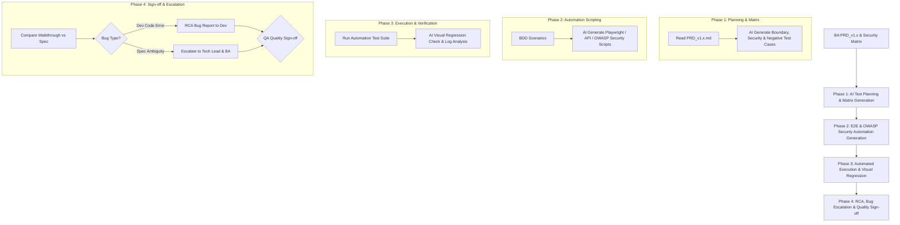

# Standard Operating Procedure (SOP): AI Agent Workflow Cho QA/QC (Quality Assurance / Quality Control)

> [!NOTE]
> **PLATFORM AGNOSTIC NOTICE**
> Tài liệu này được thiết kế độc lập với nền tảng AI. Hướng dẫn áp dụng nhất quán cho bất kỳ AI Agent nào (Antigravity, Claude Code, Cursor, Windsurf, Copilot, v.v.).

## 1. Tổng Quan Vai Trò Của QA/QC Trong AI-Driven SDLC

Trong mô hình **Spec-Driven SDLC**, **QA/QC Engineer** đóng vai trò là **Quality Architect & Gatekeeper**. QA/QC không chỉ kiểm thử sản phẩm sau cùng mà tham gia ngay từ đầu, biến các **BDD Specs (Given-When-Then)** và **Security Matrix** của BA thành **Automation Test Suites**, đồng thời kiểm tra tính tương thích liên vai trò (Cross-Role Verification).

---

## 2. RACI Matrix (Khâu Quality Assurance & Control)

| Hoạt động | QA/QC Engineer | BA | Dev Team / AI | AI Agent (QA Assistant) |
| :--- | :---: | :---: | :---: | :---: |
| **1. Test Planning & Security Matrix** | **R / A** | **C** (Clarify specs) | **I** | **R** (Sinh Test Matrix, Security & Edge Cases) |
| **2. Automation Scripting** | **R / A** | **I** | **I** | **R** (Sinh code Playwright/API/Security Test) |
| **3. Test Execution & Visual Check** | **R / A** | **I** | **C** | **R** (Chạy E2E, So sánh Visual Diff) |
| **4. Dev Walkthrough Audit** | **R / A** | **C** | **C** (Cung cấp Walkthrough) | **R** (So sánh Walkthrough vs PRD) |
| **5. Cross-Role Bug Escalation & RCA** | **R / A** | **C** (Sửa Spec nếu hổng) | **R** (Fix code) | **R** (Phân tích nguyên nhân gốc RCA & Phân loại Bug) |

---

## 3. Chi Tiết Các Use Case QA/QC Sử Dụng AI Agent

### Use Case 1: Tự Động Sinh Test Matrix & Edge Case Test Cases
- **Mục tiêu**: Bao phủ 100% các kịch bản kiểm thử (Positive, Negative, Boundary, Security, Concurrency).
- **Cách QA dùng AI**: Input `PRD_v1.x.md` $\rightarrow$ Output bảng **Test Matrix** đầy đủ kịch bản biên và bảo mật OWASP Top 10.

### Use Case 2: Tự Động Sinh Script Automation Test & Security Scan
- **Mục tiêu**: Chuyển đổi BDD Given-When-Then và Security Matrix thành code kiểm thử tự động Playwright (TypeScript) hoặc REST Assured.

### Use Case 3: Kiểm Thử So Sánh Giao Diện (Visual Regression Testing)
- **Mục tiêu**: Chụp màn hình và so sánh pixel diff tránh vỡ layout.

### Use Case 4: Quy Trình Phân Loại Lỗi & Cross-Role Bug Escalation (RCA)
- **Quy trình Phân loại Bug**:
  1. **Dev Code Bug**: Code không khớp với PRD Spec $\rightarrow$ Gửi Bug Report kèm RCA Log cho Dev.
  2. **Spec Ambiguity / Conflict Bug**: Mâu thuẫn logic trong PRD $\rightarrow$ Escalated tới **Tech Lead & BA** để cập nhật Spec (`PRD_v1.1.md`).
  3. **Environment / Infrastructure Bug**: Lỗi timeout DB/API $\rightarrow$ Escalated tới DevOps.

---

## 4. Công Cụ Hỗ Trợ: Recommended Skills & MCP Servers Cho QA/QC

### MCP Servers Ưu Tiên:
- **`playwright`**: Công cụ nòng cốt chạy Automation E2E test, chụp screenshot, bắt network trace.
- **`jira`**: Tự động tạo Bug Ticket chuẩn (kèm Steps to reproduce, Expected vs Actual behavior, RCA analysis).
- **`mysql` / `postgresql`**: Query trực tiếp DB xác minh dữ liệu nghiệp vụ sau khi chạy E2E flow.

### Skills Quy Trình Ưu Tiên:
- **`browser-testing-with-devtools`**: Điều khiển trình duyệt, kiểm thử giao diện thực tế.
- **`observability-and-instrumentation`**: Thu thập log, trace lỗi cross-service để làm báo cáo RCA.
- **`systematic-debugging`**: Tìm nguyên nhân gốc của bug trước khi phân loại escalation.

---

## 5. Checklist Kiểm Duyệt Của QA/QC (QA Quality Gate)

> [!IMPORTANT]
> **QA Acceptance Sign-off Checklist**
> - [ ] 100% BDD Acceptance Criteria trong PRD đã có Test Case tương ứng.
> - [ ] Đã thực thi các kịch bản **Security Scan (XSS, Injection, Auth Checks)**.
> - [ ] Automated API / E2E Test Suite chạy pass 100% không flaky.
> - [ ] Báo cáo `walkthrough.md` của Dev khớp hoàn toàn với yêu cầu của BA.
> - [ ] Mọi bug phát hiện đã được phân loại nguồn gốc và xử lý triệt để.
