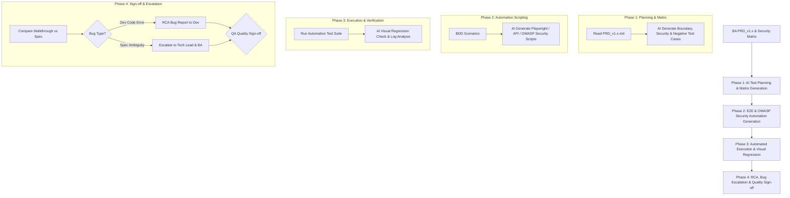

# Standard Operating Procedure (SOP): AI Agent Workflow Cho QA/QC (Quality Assurance / Quality Control)

## 1. Tổng Quan Vai Trò Của QA/QC Trong AI-Driven SDLC

Trong mô hình **Spec-Driven SDLC**, **QA/QC Engineer** đóng vai trò là **Quality Architect & Gatekeeper**. QA/QC không chỉ kiểm thử sản phẩm sau cùng mà tham gia ngay từ đầu, biến các **BDD Specs (Given-When-Then)** và **Security Matrix** của BA thành **Automation Test Suites**, đồng thời kiểm tra tính tương thích liên vai trò (Cross-Role Verification).



---

## 2. RACI Matrix (Khâu Quality Assurance & Control)

| Hoạt động | QA/QC Engineer | BA | Dev Team / AI | AI Agent (QA Assistant) |
| :--- | :---: | :---: | :---: | :---: |
| **1. Test Planning & Security Matrix** | **R / A** | **C** (Clarify specs) | **I** | **R** (Sinh Test Matrix, Security & Edge Cases) |
| **2. Automation Scripting** | **R / A** | **I** | **I** | **R** (Sinh code Playwright/API/Security Test) |
| **3. Test Execution & Visual Check** | **R / A** | **I** | **C** | **R** (Chạy E2E, So sánh Visual Diff) |
| **4. Dev Walkthrough Audit** | **R / A** | **C** | **C** (Cung cấp Walkthrough) | **R** (So sánh Walkthrough vs PRD) |
| **5. Cross-Role Bug Escalation & RCA** | **R / A** | **C** (Sửa Spec nếu hổng) | **R** (Fix code) | **R** (Phân tích nguyên nhân gốc RCA & Phân loại Bug) |

---

## 3. Chi Tiết Các Use Case QA/QC Sử Dụng AI Agent

### Use Case 1: Tự Động Sinh Test Matrix & Edge Case Test Cases
- **Mục tiêu**: Bao phủ 100% các kịch bản kiểm thử (Positive, Negative, Boundary, Security, Concurrency).
- **Cách QA dùng AI**:
  - Input: File `PRD_v1.x.md` của BA.
  - Output từ AI Agent: Bảng **Test Matrix** bao gồm kịch bản kiểm thử chức năng, biên dữ liệu và kịch bản bảo mật (OWASP Top 10: XSS, SQL Injection, Auth Bypass).

### Use Case 2: Tự Động Sinh Script Automation Test & Security Scan
- **Mục tiêu**: Chuyển đổi BDD Given-When-Then và Security Matrix thành code kiểm thử tự động.
- **Cách QA dùng AI**:
  - Input: BDD Scenarios & Security Rules.
  - Output: Mã nguồn Playwright (TypeScript) kiểm thử E2E và Script API Security Check:
    ```typescript
    import { test, expect } from '@playwright/test';

    test('Security Check - XSS Input Sanitization', async ({ page }) => {
      await page.goto('/profile/edit');
      const xssPayload = '<script>alert("XSS")</script>';
      await page.fill('#bio-input', xssPayload);
      await page.click('#save-btn');

      // Verify XSS payload is escaped/sanitized
      const bioText = await page.locator('.user-bio').innerHTML();
      expect(bioText).not.toContain('<script>');
    });
    ```

### Use Case 3: Kiểm Thử So Sánh Giao Diện (Visual Regression Testing)
- **Mục tiêu**: Phát hiện vỡ layout, lệch font, vỡ màu sắc hoặc Layout Shift giữa các phiên bản build.
- **Cách QA dùng AI**:
  - AI tự động điều khiển trình duyệt headless, chụp màn hình và so sánh pixel diff so với phiên bản trước.

### Use Case 4: Quy Trình Phân Loại Lỗi & Cross-Role Bug Escalation (RCA)
- **Mục tiêu**: Xác định chính xác lỗi do đâu và gửi báo cáo phân cấp đúng người xử lý.
- **Quy trình Phân loại Bug**:
  1. **Dev Code Bug**: Code không khớp với PRD Spec $\rightarrow$ AI tạo Bug Ticket đẩy trực tiếp cho Backend/Frontend Dev kèm RCA Log.
  2. **Spec Ambiguity / Conflict Bug**: Mâu thuẫn logic trong PRD $\rightarrow$ Escalated tới **Tech Lead & BA** để cập nhật Spec (`PRD_v1.1.md`).
  3. **Environment / Infrastructure Bug**: Lỗi timeout kết nối DB / API 3rd party $\rightarrow$ Escalated tới DevOps / SysAdmin.

---

## 4. Quy Trình 4 Bước Cụ Thể Cho QA/QC (QA Workflow Steps)

### Step 1: Test Planning & Matrix (Pha 1 - Đặt Hàng Test Case)
- Đọc `PRD_v1.x.md` của BA $\rightarrow$ Sử dụng AI tạo `test_matrix.md` bao gồm kịch bản chức năng, hiệu năng nhẹ và kiểm thử an ninh.

### Step 2: Automation Scripting (Pha 2 - Chuẩn Bị Automation)
- Sử dụng AI sinh các file Playwright / API test script trong thư mục `tests/e2e/` và `tests/security/`.

### Step 3: Execution & Audit (Pha 3 - Chạy Test & Đối Soát)
- Chạy Automation Suite.
- Sử dụng AI rà soát `walkthrough.md` của Dev để xác nhận 100% kịch bản nghiệm thu đã pass.

### Step 4: Quality Sign-off / Bug Escalation (Pha Ký Duyệt & Báo Lỗi)
- Nếu Pass: QA tiến hành Sign-off trên Ticket.
- Nếu Fail: Sử dụng AI phân tích nguyên nhân gốc (RCA), phân loại lỗi (Dev vs BA vs Infra) và gửi Bug Report tương ứng.

---

## 5. Checklist Kiểm Duyệt Của QA/QC (QA Quality Gate)

> [!IMPORTANT]
> **QA Acceptance Sign-off Checklist**
> - [ ] 100% BDD Acceptance Criteria trong PRD đã có Test Case tương ứng.
> - [ ] Đã thực thi các kịch bản **Security Scan (XSS, Injection, Auth Checks)**.
> - [ ] Automated API / E2E Test Suite chạy pass 100% không flaky.
> - [ ] Không còn lỗi vỡ layout hoặc console error trên các độ phân giải màn hình.
> - [ ] Báo cáo `walkthrough.md` của Dev khớp hoàn toàn với yêu cầu của BA.
> - [ ] Mọi bug phát hiện đã được phân loại nguồn gốc (Dev vs BA Spec vs Infra) và xử lý triệt để.
