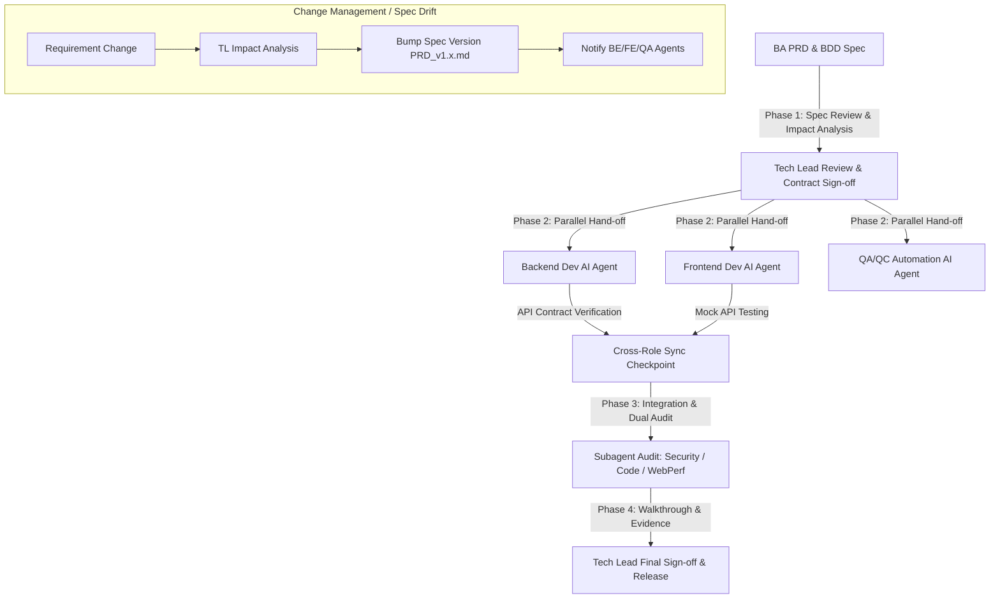

# Standard Operating Procedure (SOP): AI Agent Workflow Cho Tech Lead / Orchestrator

> [!NOTE]
> **PLATFORM AGNOSTIC NOTICE**
> Tài liệu này được thiết kế độc lập với nền tảng AI. Hướng dẫn áp dụng nhất quán cho bất kỳ AI Agent nào (Antigravity, Claude Code, Cursor, Windsurf, Copilot, v.v.).

## 1. Tổng Quan Vai Trò Của Tech Lead Trong AI-Driven SDLC

Trong mô hình **Spec-Driven SDLC**, **Tech Lead / Software Architect** đóng vai trò là **System Orchestrator & Quality Supervisor**. Tech Lead không trực tiếp viết toàn bộ code mà chịu trách nhiệm điều phối luồng làm việc liên vai trò (Cross-Role Orchestration) giữa BA, Backend, Frontend và QA/QC, đảm bảo tính nhất quán kiến trúc, quản lý thay đổi (Spec Drift) và làm người phê duyệt cuối cùng (Final Approver).

---

## 2. RACI Matrix (Khâu Orchestration & Governance)

| Hoạt động | Tech Lead / Architect | BA | Dev BE / FE | QA/QC | AI Orchestrator Agent |
| :--- | :---: | :---: | :---: | :---: | :---: |
| **1. Architecture & Spec Alignment** | **A / R** | **C** | **I** | **I** | **R** (Scan architecture & Impact Analysis) |
| **2. Cross-Role API Contract Sync** | **A** | **I** | **R** (Thỏa thuận Schema DTO) | **C** | **R** (Verify JSON Contract compatibility) |
| **3. Spec Drift & Change Control** | **A / R** | **R** (Cập nhật PRD) | **C** (Đánh giá effort) | **C** | **R** (Tự động thông báo diff & version bump) |
| **4. Dual-Gate Review Approval** | **A** | **I** | **R** (Nộp Walkthrough) | **R** (Ký duyệt Test) | **C** (Kiểm tra checklist tự động) |
| **5. Breaking Change & Deprecation** | **A / R** | **I** | **R** (Thực thi Rollback plan) | **C** | **R** (Scan breaking change & API diff) |

---

## 3. Quy Trình Điều Phối Liên Vai Trò (Cross-Role Orchestration Protocols)

### Protocol 1: Cross-Role API Contract Synchronization
- **Mục tiêu**: Đảm bảo Backend và Frontend đồng bộ 100% về API Contract (DTOs, Endpoint paths, HTTP status codes, Query params) trước khi bắt đầu code song song.
- **Quy trình**:
  1. Backend Agent thiết kế API DTO trong `implementation_plan.md`.
  2. Tech Lead AI Orchestration kích hoạt bước kiểm tra tương thích contract giữa BE plan và FE UI State Plan.
  3. Frontend Agent tạo ngay **API Mock (MSW / Pact)** dựa trên DTO đã chốt để phát triển UI không phụ thuộc vào tiến độ Backend.

### Protocol 2: Spec Drift & Requirement Change Management
- **Mục tiêu**: Xử lý biến động yêu cầu nghiệp vụ khi dự án đang trong pha triển khai mà không làm mất dấu vết (Loss of Context) hoặc gây mâu thuẫn giữa các role.
- **Quy trình 4 bước khi có Spec Change**:
  1. **Spec Version Bump**: BA nâng phiên bản tài liệu (`PRD_v1.0.md` $\rightarrow$ `PRD_v1.1.md`) và ghi rõ mục `## Revision History`.
  2. **Impact Analysis Scan**: AI Orchestrator thực hiện quét tác động:
     - *Backend Impact*: Cần bổ sung/sửa đổi bảng DB hay API nào.
     - *Frontend Impact*: Cần thêm UI State hay props nào.
     - *QA Impact*: Cần bổ sung Test Matrix / E2E Cases nào.
  3. **Plan Revision**: Kích hoạt BE, FE, QA cập nhật lại `implementation_plan.md`.
  4. **TL Approval**: Tech Lead phê duyệt diff của Plan mới trước khi tiếp tục code.

### Protocol 3: Breaking Changes & Migration Deprecation Policy
- **Mục tiêu**: Đảm bảo nâng cấp hệ thống không làm sập ứng dụng đang chạy (Zero-downtime & Backward Compatibility).
- **Quy tắc**:
  - Không xoá trực tiếp field/endpoint cũ. Phải đánh cờ `@Deprecated(since = "v1.1")` và duy trì tối thiểu 1 phiên bản chuyển giao.
  - Database Migration (Liquibase/Flyway) **bắt buộc** có script Rollback đi kèm trong file migration.
  - Frontend phải có fallback UI khi nhận dữ liệu từ API cũ hoặc lỗi schema tạm thời.

---

## 4. Công Cụ Hỗ Trợ: Recommended Skills & MCP Servers Cho Tech Lead

### MCP Servers Ưu Tiên:
- **`github` / `gitlab`**: Quản lý repository, tạo & review Pull Request, kiểm tra status của CI/CD pipeline.
- **`jira` / `confluence`**: Quản lý Sprint Epic/Tickets, liên kết PRD Spec với công việc triển khai.
- **`mysql` / `postgresql`**: Đối soát trực tiếp Database Migration schema và index performance.

### Skills Quy Trình Ưu Tiên:
- **`architect-review`**: Rà soát tính toàn vẹn kiến trúc, đảm bảo tuân thủ SOLID, Clean Architecture và microservice boundaries.
- **`architecture-decision-records` (ADR)**: Ghi lại các quyết định kiến trúc quan trọng và lý do lựa chọn.
- **`code-review-and-quality`**: Đánh giá đa chiều chất lượng code trước khi duyệt Merge vào nhánh chính.

---

## 5. Checklist Phê Duyệt Dành Cho Tech Lead (Orchestrator Quality Gate)

> [!IMPORTANT]
> **Tech Lead Project Release Sign-off Checklist**
> - [ ] Tất cả PRD Specs có phiên bản rõ ràng (`PRD_v1.x.md`) và đã qua BA Quality Gate.
> - [ ] API Contract giữa Backend và Frontend khớp 100% không còn xung đột DTO.
> - [ ] Báo cáo `walkthrough.md` từ Backend có đủ log unit/integration test pass 100% và không dính N+1 query.
> - [ ] Báo cáo `walkthrough.md` từ Frontend có đính kèm screenshot visual verification và 0 console error.
> - [ ] Báo cáo nghiệm thu từ QA/QC xác nhận 100% Acceptance Criteria đã pass trên Automation Suite.
> - [ ] Không có breaking change trên public API nếu chưa có kế hoạch Deprecation & Rollback.
